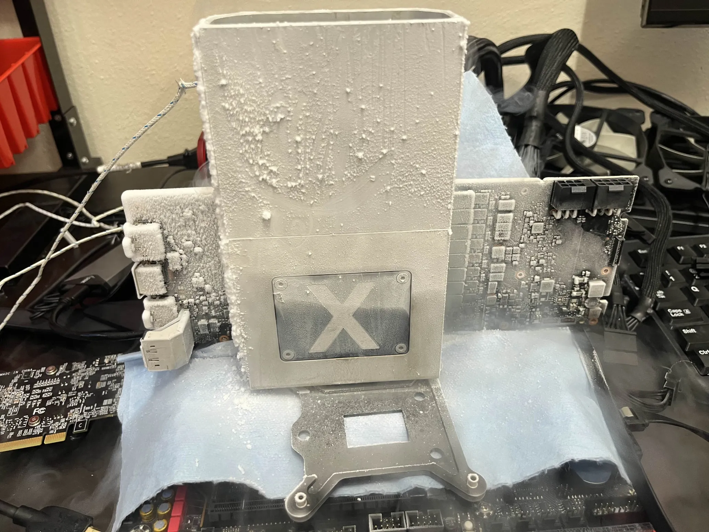
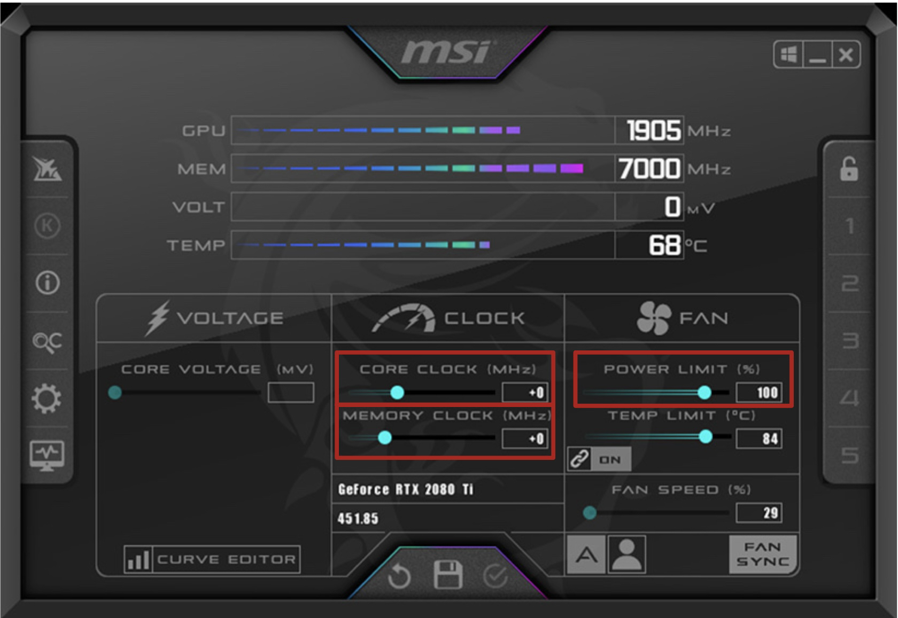

# GPU

Graphics Processing Unit Overclocking

## Methodology

GPUs are generally made up of two separate overclockable parts: VRAM and the CORE. These both have a base frequency that can be increased with software tools such as MSI Afterburner.

As a general rule, the memory clocks will tend to be quite a bit faster than the core clocks. Additionally, the memory clocks can be increased by a larger value than the core clocks when overclocking. Despite this, most benchmarks, especially those that involve 3D rendering, see larger performance increases from overclocking the core.

### Power

In software overclocking tools, GPUs generally have a 'Power Slider' which can theoretically increase the power available to the card. Set this to maximum value and leave it there. 

Additionally, really old GPUs will sometimes have a voltage slider in addition to the power slider. These can be used in a similar way to CPU overclocking in an attempt to increase performance.

Since no modern GPUS (eg GPUs manufactured in the last decade) have this feature, we will not discuss this specific form of GPU overclocking here.

### VRAM

Generally speaking, VRAM should be overclocked before the core. It tends to be a lot more stable than the core when at higher frequencies and gives a baseline increase in performance that benefits all the benchmarks that are ran. Additionally, you can come back to the VRAM once you have tuned your core overclock if you need just a bit more performance to set a record.

> NOTE:
> In newer generations of graphics cards, often error-correcting memory is found. This means that while a faster clock speed might work in due to the error-correcting, it might be slower in practice due to having to correct more errors as the data is being transferred. Because of this, make sure to validate all memory changes with real performance scores on such platforms.

To overclock memory, it is relatively easy on GPUs which involves increasing the frequency number in MSI Afterburner. You do this until you can no longer run the benchmark you are trying to run **or** the benchmark performs worse due to the aforementioned error-correcting issues.

#### Procedure

A good way to start is to overclock 100MHz on the memory and start your benchmark. If it continues to run for at least 10 seconds, stop the benchmark and then increase another 100MHz. Once the benchmark crashes in that time, drop to the previous frequency and attempt to complete the benchmark. It can be common to see 500MHz overclocks or higher on VRAM using this procedure.

Sometimes this will crash and you will have to lower the overclock even more. Once you have made a full run, you can try increasing by 50MHz or smaller values to attempt to push even more out of the benchmark. This finer tuning is usually a good candidate to do once the core overclock has been completed.

As there is generally not memory voltage control included in MSI Afterburner, there is not a ton of tweaking that can be achieved without more invasive hardware modifications.

> As a last addendum, make sure to keep track of the temperature of the VRAM. If it gets too cold due to liquid nitrogen or other cooling solutions (or too hot if there is no direct cooling solution for it), there can be stability or performance issues that need to be accounted for.

### Core

GPU cores can also be overclocked in a similar way to GPU memory; although, they will have less headroom to be overclocked.

> Note:
> NVIDIA GPUs (and possibly AMD but untested) have a minimum frequency change of 15MHz. This means that increasing or decreasing by any value smaller than that will result in no actual changes to the GPU clocks. It does not hurt to have a smaller value, it just does not change anything. Keep this in mind; also, we recommend using a tool to verify that the clocks are changing.

#### Procedure

Start in MSI Afterburner similar to the VRAM overclocking. Once there, increase the core clocks by 100MHz and see if that works. If it does not, decrease it by 15MHz and try again.

On Liquid nitrogen on really highly-binned GPUs, you can get multiple hundred MHz increases (around 450MHz on our RTX2070). However, these are not a given and oftentimes hitting more than 200MHz overclock is difficult or impossible.

Since there is no proper voltage control, it can be difficult to see significant increases in core clocks on some GPUs.

> Note on Power:
> Most GPUs will have a maximum power that the card can draw. This is spread between the cooling, the core, and memory (for the most part). This means that sometimes it can be more beneficial to decrease the VRAM overclock, in turn giving the core more power to draw and thus increasing your scores.
>
> Additionally, if you can use non-integrated cooling for your GPU (eg by using fans connected to case power and disconnecting the fans on the GPU), you can salvage a couple extra watts of power that can be used by the card.
